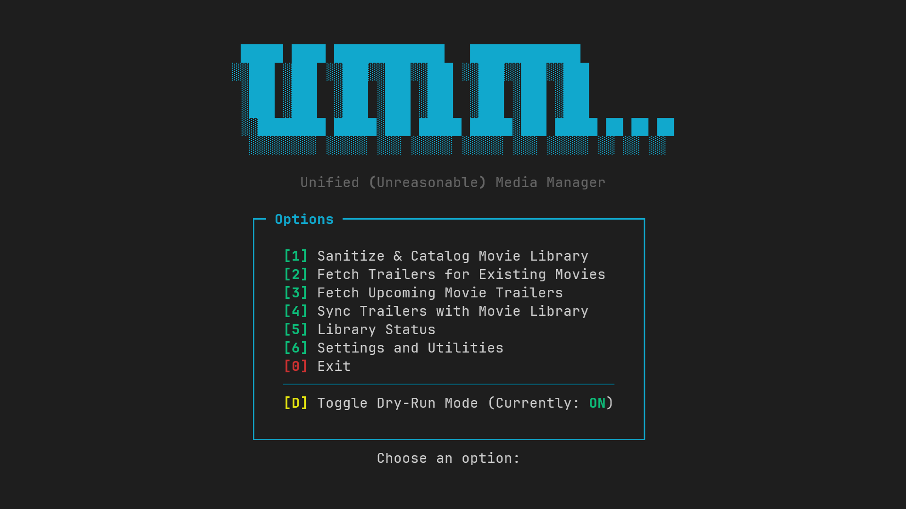

# UMM - Unified (Unreasonable) Media Manager

> *Because managing your media manually is... unreasonable.*

[](https://www.python.org/)
[](LICENSE)
[](#)




UMM (Unified Media Manager) is a modular Python-based tool that automates fetching, downloading, and organizing movie trailers, complete with placeholder and backdrop generation.

## Why UMM...
I used to have a bunch of PowerShell scripts to help organize my growing movie collection. But as I kept adding new scripts for each task I wanted automated, it became cumbersome to maintain.

That’s when I decided to combine everything into one modular tool and UMM was born. The new version is built around a safety-first philosophy, giving you complete control over every file change!

[!NOTE]
This is a work in progress, so expect improvements and changes over time.


## Features
- **Interactive Menu Interface:** Easy-to-use persistent menu for all operations.
- **Interactive Dry-Run Mode:** Safely simulate *all* file operations (rename, move, delete) and review a log before execution.
- **Library Sanitation:** Automatically rename, organize, and catalog your existing movie files into the clean `Movie Title (YEAR)` folder structure.
- **Intelligent Trailer Fetching:** Checks the latest movies from TMDB and downloads the best quality trailer from YouTube using `yt-dlp`. The selection logic prioritizes **Official Trailers** first.
- **Comprehensive Caching:** Uses `library.json`, `upcoming_cache.json`, and `known_failures.json` for fast operation and preventing repeated failed attempts.
- **Asset Generation:** Generate placeholder videos and custom black backdrops using `ffmpeg` for services like Jellyfin's Cinema Mode.
- Concurrent processing with thread-safe task handling.

## Requirements
- Python 3.10+
- FFmpeg (must be accessible in PATH)
- yt-dlp (must be accessible in PATH)

## Installation
Clone the repository and install dependencies:
```bash
git clone https://github.com/mult1v4c/umm.git
cd umm
pip install -r requirements.txt
```

## Configuration & First Run
On the first launch, UMM will generate a default `config.json` file in your repository folder.
```
python umm.py
```
[!NOTE]
You must edit `config.json` to enter your `TMDB_API_KEY` before using the fetch features. All other settings, including folder paths and worker threads, can be easily adjusted via the `[6] Settings and Utilities` menu option!


| Option                   | Description                                       |
| ------------------------ | ------------------------------------------------- |
| `TMDB_API_KEY`           | Your TMDB API key (required)                      |
| `MOVIE_LIBRARY`          | Root folder for your organized movies             |
| `DOWNLOAD_FOLDER`        | Folder where upcoming trailers are downloaded     |
| `CACHE_FOLDER`           | Local cache directory for TMDB data               |
| `MAX_DOWNLOAD_WORKERS`   | Number of parallel download threads               |
| `MAX_FFMPEG_WORKERS`     | Number of parallel FFmpeg tasks                   |
| `CREATE_BACKDROP`        | Whether to generate backdrop images               |

## Interactive UMM Menu

The tool runs in a persistent, easy-to-use menu. All critical operations are guarded by the Dry-Run Mode.

Core Principles

1. **Safety First:** The menu starts with Dry-Run Mode ON for your protection.

2. **Interactive Confirmation:** For actions that modify files, UMM will run a dry simulation, show you the planned changes, and ask for explicit confirmation (`y/n`) before making any changes.

### Menu Options Explained
|Option|Function                          |Summary of Action                                                                                                                                                                     |
|------|----------------------------------|--------------------------------------------------------------------------------------------------------------------------------------------------------------------------------------|
|`[1]`   |Sanitize & Catalog Movie Library  |Scans your `/Movies` folder, cleans messy filenames, renames and organizes files into the standard `Movie Title (YEAR)` folder structure, and builds the `library.json` catalog.            |
|`[2]`   |Fetch Trailers for Existing Movies|Iterates through your organized `library.json` and downloads any missing trailers directly into your organized movie folders.                                                           |
|`[3]`   |Fetch Upcoming Movie Trailers     |Queries TMDB for new and popular movies, downloads trailers into the dedicated `/Trailers` (or `DOWNLOAD_FOLDER`) path, and generates black placeholder videos and backdrops for Jellyfin.|
|`[4]`   |Sync Trailers with Movie Library  |Finds movies in the `/Trailers` folder that now exist in your main library and moves the trailer/assets to the correct library movie folder.                                            |
|`[5]`   |Library Status                    |A quick dashboard showing total movies, missing trailers, and recent UMM activity.                                                                                                    |
|`[6]`   |Settings and Utilities            |Access to change folder paths, API keys, worker counts, and clear various caches (e.g., junk words, known failures).                                                                  |
|`[D]`   |Toggle Dry-Run Mode               |Toggles the crucial safety mode ON or OFF.                                                                                                                                            |


## Jellyfin Integration
I use Jellyfin with several plugins and one of which is [Cinema Mode](https://github.com/CherryFloors/jellyfin-plugin-cinemamode). It uses local trailers from a library within Jellyfin and plays them before your selected media (just like in the theaters). UMM's role is to download upcoming movie trailers and set them up correctly.

Since Jellyfin does not recognize trailers as actual movies, you need placeholder files with the same name for it to properly display in your library. UMM generates a 1-second video file and names it accordingly. This way, the library may now be used with cinema mode. This is explained better in this [Reddit post](https://www.reddit.com/r/JellyfinCommunity/comments/1mm9n6c/bringing_movie_theater_magic_to_jellyfin_my/).

The custom black backdrop.jpg UMM generates helps enhance the cinematic immersion by covering the brief delay between trailers with a solid black screen instead of a quick flash of the actual backdrop generated by Jellyfin.

Here's a sample directory structure:
```
📁 Media/Trailers/
│
└── Oppenheimer (2023)/
    ├── Oppenheimer (2023)-trailer.mp4  <-- Trailer downloaded from YouTube
    ├── Oppenheimer (2023).mp4          <-- Black placeholder video
    └── backdrop.jpg                    <-- Custom black backdrop
```

## Future Plans
The core menu and major functions are now implemented! Here are a few things planned for the future:

- [ ] Add a function to automatically delete empty folders created during the library sanitation and sync process.
- [ ] Granular control over the trailer selection logic within the Settings menu.